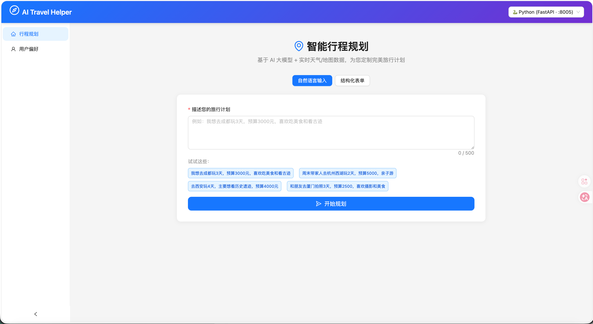
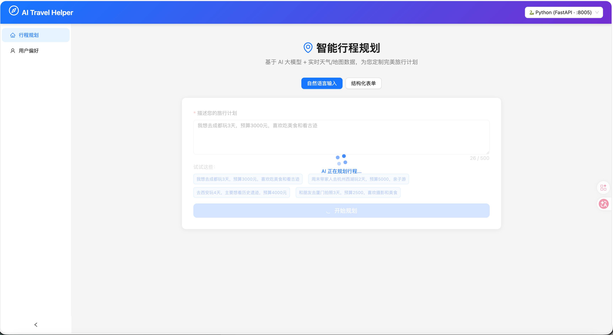
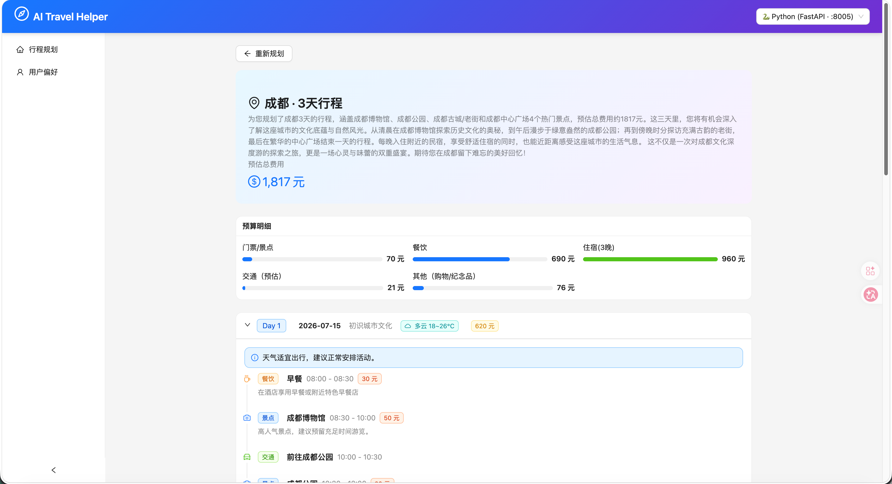
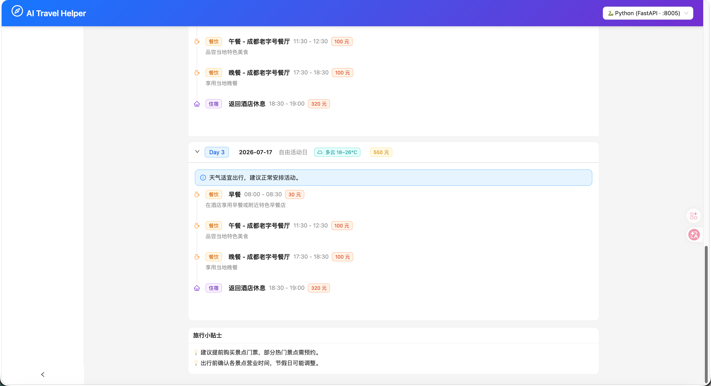
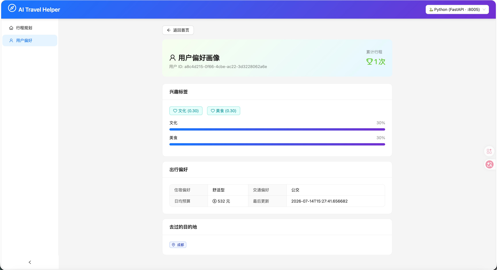

# AI Travel Helper Frontend

## 智能行程规划前端界面

AI Travel Helper 的 React 单页应用前端，提供自然语言与结构化表单两种交互模式，支持对接 Java 或 Python 后端服务。

---

## 功能特性

- **双模式输入** — 自然语言输入 + 结构化表单，满足不同使用习惯
- **后端切换** — 前端内置切换器，支持运行时切换 Java / Python 后端
- **行程可视化** — 时间线展示行程安排，包含预算分解、天气预警等详细信息
- **偏好管理** — 用户偏好可视化展示（标签权重、历史行程记录）
- **无感用户标识** — Cookie 自动生成并持久化用户 ID，无需登录即可使用

---

## 技术栈

| 分类     | 技术                 | 说明                          |
| -------- | -------------------- | ----------------------------- |
| 框架     | **React 18**         | UI 组件库                     |
| 构建     | **Vite 6**           | 极速开发服务器与构建工具      |
| UI 组件  | **Ant Design 5**     | 企业级 UI 组件                |
| 样式     | **Tailwind CSS 3**   | 原子化 CSS，快速开发          |
| HTTP     | **Axios**            | 后端 API 通信                 |
| 路由     | **React Router 6**   | SPA 页面路由                  |
| 日期     | **dayjs**            | 轻量日期处理                  |

---

## 运行效果
### 主页


### 行程规划




### 用户偏好



## 快速开始

### 环境要求

- Node.js 18+
- npm 9+

### 安装与运行

```bash
# 安装依赖
npm install

# 启动开发服务器 (默认 http://localhost:5173)
npm run dev

# 生产构建 (输出到 dist/)
npm run build

# 预览生产构建
npm run preview
```

---

## 后端连接

### 开发模式 — Vite Proxy

开发环境下，`/api` 前缀的请求通过 Vite 代理转发到后端服务，避免跨域问题：

```js
// vite.config.js
server: {
  proxy: {
    '/api': {
      target: 'http://localhost:8080', // Java 后端
      // target: 'http://localhost:8005', // Python 后端
      changeOrigin: true,
    },
  },
},
```

修改 `target` 地址切换目标后端，重启开发服务器即可生效。

### 运行时切换 — Backend Switcher

前端页面提供后端切换下拉框，可在运行时动态切换目标后端：

| 选项     | 目标地址                  |
| -------- | ------------------------- |
| Java     | `http://localhost:8080`   |
| Python   | `http://localhost:8005`   |

切换后所有 API 请求自动指向新的后端地址，无需刷新页面。

### 生产部署

生产环境下前端与后端同域部署，所有请求直接发送到同源地址，无需代理或跨域配置。

---

## 项目结构

```
travel-helper-frontend/
├── public/                   # 静态资源
├── src/
│   ├── api/
│   │   └── client.js         # Axios 客户端 + 后端切换逻辑
│   ├── components/
│   │   └── AppLayout.jsx     # 全局布局组件 (导航栏、后端切换器)
│   ├── pages/
│   │   ├── HomePage.jsx      # 首页 — 行程规划输入
│   │   ├── ResultPage.jsx    # 结果页 — 行程时间线展示
│   │   └── PreferencesPage.jsx # 偏好页 — 用户偏好管理
│   ├── index.css             # Tailwind 全局样式
│   ├── main.jsx              # React 应用入口
│   └── App.jsx               # 路由配置
├── index.html                # HTML 入口
├── vite.config.js            # Vite 构建配置
├── tailwind.config.js        # Tailwind CSS 配置
├── postcss.config.js         # PostCSS 配置
└── package.json              # 项目依赖
```

---

## 构建与部署

### 构建

```bash
npm run build
```

构建产物输出到 `dist/` 目录：

```
dist/
├── index.html
└── assets/
    ├── index-[hash].js
    └── index-[hash].css
```

### 部署方式

**方式一：独立静态服务**

```bash
# 任意静态文件服务器
npx serve dist -p 3000
# 或
nginx -c nginx.conf
```

**方式二：嵌入 Python 后端**

将 `dist/` 目录复制到 Python 项目的 `frontend-dist/` 目录，FastAPI 自动识别并提供静态文件服务与 SPA 回退路由：

```bash
cp -r dist/ ../travel-helper-python/frontend-dist/
```

**方式三：嵌入 Java 后端**

将 `dist/` 内容放入 Java 项目的 `src/main/resources/static/` 目录，Spring Boot 自动提供静态资源服务。

### 环境要求

前端为纯静态资源，无运行时依赖，可部署到任何支持静态文件的平台（CDN、OSS、Nginx 等）。

---

## 许可证

本项目仅供学习参考使用。
